# Chameleon CRM UI/UX Specification

**Version:** 1.0
**Date:** October 21, 2025
**Product Name:** Chameleon CRM (AI-First WordPress-Like CRM Platform)
**Status:** Draft

---

## Change Log

| Date | Version | Description | Author |
|------|---------|-------------|--------|
| 2025-10-21 | 1.0 | Initial UI/UX specification | UX Expert Sally |

---

## Introduction

This document defines the user experience goals, information architecture, user flows, and visual design specifications for Chameleon CRM's user interface. It serves as the foundation for visual design and frontend development, ensuring a cohesive and user-centered experience.

Chameleon CRM represents a paradigm shift in CRM design - combining WordPress's ease of use with AI-native intelligence and modern web technologies. The interface must feel familiar yet revolutionary, simple yet powerful, invisible yet omnipresent.

**Strategic Design Direction:** CRM-first with architecture designed for future website builder plugin. The visual component system and builder infrastructure will support both CRM interfaces (MVP) and public website creation (future plugin).

**Document Status:** In Progress - Section 1 of 10 completed

---

## 1. Overall UX Goals & Principles

### Target User Personas

**1. The Non-Technical Business Owner**
- Small business owner or entrepreneur
- Needs CRM functionality but lacks technical skills
- Values: Simplicity, AI guidance, immediate value
- Pain point: Traditional CRMs are too complex and require IT support
- Goal: Set up and start using CRM through conversation, no training needed

**2. The Sales Professional**
- Individual contributor or sales manager
- Power user who lives in the CRM daily
- Values: Speed, efficiency, mobile access, pipeline visibility
- Pain point: Too many clicks, rigid workflows that don't match their process
- Goal: Customize their workspace, automate repetitive tasks, close deals faster

**3. The System Administrator**
- IT professional or business operations manager
- Configures and maintains the CRM for their organization
- Values: Control, security, integration capabilities, plugin ecosystem
- Pain point: Limited customization, vendor lock-in, complex integrations
- Goal: Build a tailored CRM that adapts to business needs without coding

**4. The Plugin Developer**
- Software developer building extensions
- Technical expert creating value for the community
- Values: Clear APIs, good documentation, testing tools, marketplace visibility
- Pain point: Poor dev experience, limited extension points, opaque review processes
- Goal: Create and distribute plugins easily, earn revenue from their work

---

### Usability Goals

**1. Zero-to-Value in 5 Minutes**
- New users complete AI-guided setup and create their first contact within 5 minutes
- No manuals, videos, or training required
- Success metric: 90% of users create first contact in first session

**2. WordPress-Level Ease of Use**
- Non-technical users can customize interfaces through visual builders
- Familiar patterns from WordPress (left sidebar, top bar, drag-drop)
- Success metric: 80% of users successfully customize a dashboard without help

**3. AI-Assisted Everything**
- Every complex task has an AI assistant option
- Users can accomplish tasks through conversation OR visual interface
- Success metric: 60% of users engage with AI assistance in first week

**4. Plugin Discovery & Installation < 1 Minute**
- Find, install, and activate plugins in under 60 seconds
- Clear descriptions, screenshots, ratings visible
- Success metric: 95% of plugin installs complete successfully

**5. Real-Time Collaboration**
- Multiple users see changes instantly (Supabase Realtime)
- No refresh needed, no conflicts
- Success metric: < 500ms latency for real-time updates

**6. Mobile-First for Core Tasks**
- Essential tasks (view contacts, update deals, complete tasks) work perfectly on mobile
- Touch-optimized interfaces for phones
- Success metric: 40% of daily active users access via mobile

---

### Design Principles

**1. Conversational First, Visual Always**
- Users can accomplish tasks through natural language OR visual interface
- Never force one interaction method
- AI chat is contextual, not a separate mode
- *Example: "Create a contact" can be typed to AI or clicked from visual menu*

**2. Invisible Infrastructure**
- Technology disappears when working well
- Setup, configuration, updates happen automatically
- Users focus on their work, not "using the CRM"
- *Example: No "settings" page - AI manages configuration in background*

**3. Progressive Disclosure**
- Show only what's needed for current task
- Advanced features revealed as user gains expertise
- Empty states guide next actions
- *Example: New users see 3 menu items, power users see full capabilities*

**4. Immediate & Intelligent Feedback**
- Every action has instant, clear response
- AI explains what happened and suggests next steps
- Errors are helpful, never cryptic
- *Example: Deleting contact shows undo option + AI suggests archiving instead*

**5. Composable by Design**
- Everything is a reusable component
- Users combine components to create custom solutions
- Plugins extend, never replace core
- **Architecture supports both CRM and future website components**
- *Example: DealPipeline component works in dashboards today, could work in public pages via plugin tomorrow*

**6. Accessible by Default**
- WCAG 2.1 AA compliance is non-negotiable
- Keyboard navigation for all actions
- Screen reader tested from day one
- *Example: Visual workflow builder also has keyboard-driven mode*

**7. Performance is a Feature**
- Fast is a feature, not a technical requirement
- < 2 second page loads, < 3 second TTI
- Optimistic UI updates, background sync
- *Example: Contact saves instantly (optimistic), syncs in background*

**8. Future-Ready Component Architecture** *(Added)*
- Component system designed to support multiple contexts (CRM, websites, portals)
- Visual builder infrastructure reusable across use cases
- Plugin architecture allows extending into new domains
- *Example: Same visual builder that creates CRM dashboards could power website page builder via plugin*

---

### Architectural Considerations for Future Extensibility

**Design Decisions to Support Future Website Builder:**

**1. Context-Agnostic Components**
- Components accept `context` prop (crm | website | portal)
- Same ContactCard can render in CRM dashboard or public directory
- Styling adapts based on context

**2. Dual-Purpose Visual Builder**
- Canvas system designed for both internal and public-facing layouts
- Component palette extensible via plugins
- Templates organized by use case (CRM templates vs. website templates)

**3. Rendering Pipeline Separation**
- CRM interfaces: Server components + real-time sync (authenticated)
- Future websites: Static generation + ISR (public or gated)
- Shared component library, different rendering strategies

**4. Permission-Aware by Default**
- All components understand visibility rules
- Easy to extend to public vs. authenticated views
- RLS policies support both internal data and published content

**5. Theme System Foundation**
- Color tokens, typography, spacing already abstracted
- Future themes can override for public sites
- CRM "themes" internally prepare for website themes

---

## 2. Information Architecture (IA)

### Site Map / Screen Inventory

```mermaid
graph TD
    A[Login/Onboarding] --> B[Main Dashboard]

    B --> C[Contacts]
    B --> D[Deals]
    B --> E[Tasks]
    B --> F[Calendar]
    B --> G[Workflows]
    B --> H[Plugins]
    B --> I[AI Agents]

    C --> C1[Contact List - Grid]
    C --> C2[Contact List - Kanban]
    C --> C3[Contact List - List]
    C --> C4[Contact Detail]
    C --> C5[Create/Edit Contact]

    D --> D1[Deal Pipeline - Kanban]
    D --> D2[Deal List - Table]
    D --> D3[Deal Detail]
    D --> D4[Create/Edit Deal]

    E --> E1[Task List]
    E --> E2[Task Calendar View]
    E --> E3[Task Detail]
    E --> E4[Create/Edit Task]

    F --> F1[Month View]
    F --> F2[Week View]
    F --> F3[Day View]
    F --> F4[Event Detail]

    G --> G1[Workflow Builder]
    G --> G2[Workflow List]
    G --> G3[Workflow Execution Dashboard]
    G --> G4[Workflow History/Debug]

    H --> H1[Plugin Marketplace]
    H --> H2[Installed Plugins]
    H --> H3[Plugin Detail]
    H --> H4[Plugin Settings]

    I --> I1[AI Agent Studio]
    I --> I2[Agent Marketplace]
    I --> I3[Agent Configuration]
    I --> I4[Agent Testing Playground]

    B --> J[Dashboard Builder]
    J --> J1[Component Palette]
    J --> J2[Canvas Editor]
    J --> J3[Saved Layouts]

    B --> K[Search]
    K --> K1[Search Results]

    B --> L[Settings]
    L --> L1[Profile]
    L --> L2[Tenant Settings]
    L --> L3[User Management]
    L --> L4[Roles & Permissions]
    L --> L5[Integrations]
    L --> L6[API Keys]

    B --> M[AI Chat Assistant]
    M -.contextual.-> C
    M -.contextual.-> D
    M -.contextual.-> E
    M -.contextual.-> G
```

### Navigation Structure

**Primary Navigation (Left Sidebar - WordPress-style)**

*Collapsed by default on mobile, expanded on desktop*

**Core Sections:**
- 🏠 **Dashboard** (customizable home)
- 👥 **Contacts** (with multi-view submenu)
  - All Contacts
  - Add New
  - Import
- 💼 **Deals** (pipeline management)
  - Pipeline View
  - All Deals
  - Add New
- ✅ **Tasks** (task management)
  - My Tasks
  - All Tasks
  - Calendar View
- 📅 **Calendar** (unified calendar)

**Advanced Features:**
- ⚡ **Workflows** (visual automation)
  - My Workflows
  - Create New
  - Execution History
- 🤖 **AI Agents** (agent management)
  - Active Agents
  - Agent Studio
  - Marketplace
- 🧩 **Plugins** (extensions)
  - Installed
  - Marketplace
  - Settings

**System:**
- 🔍 **Search** (global search - always visible in top bar)
- ⚙️ **Settings** (tenant and user config)
- 👤 **Profile** (user account)

---

**Secondary Navigation (Top Bar)**

- **Tenant Switcher** (left) - If user belongs to multiple tenants
- **Global Search** (center-left) - cmd/ctrl+K shortcut
- **Quick Actions** (+) button - Context-aware create menu
- **AI Chat Toggle** (💬) - Opens contextual AI assistant
- **Notifications** (🔔) - Real-time updates
- **User Menu** (avatar) - Profile, settings, logout

---

**Breadcrumb Strategy**

- Always show current location path
- Clickable navigation back through hierarchy
- Format: Home > Contacts > John Doe
- Mobile: Show only current page + back button

---

### Progressive Disclosure Strategy

**New User (First 7 Days):**
- See only: Dashboard, Contacts, Deals, Tasks
- AI suggests "Try creating your first workflow" after 10+ contacts

**Active User (7-30 Days):**
- Workflows and Calendar auto-appear when first task/event created
- AI prompts: "Want to automate this? Try Workflows"

**Power User (30+ Days):**
- Full navigation visible
- "Advanced Mode" toggle in settings unlocks developer features
- Plugin and AI Agent sections prominent

---

### Rationale & Key Decisions

**1. AI vs. IA: The Primary Interface Decision** ⭐ *Critical Strategic Choice*

**The Question:** When users need to accomplish a task, should they primarily:
- **Option A:** Navigate via traditional menus (IA-first), with AI as helpful assistant
- **Option B:** Talk to AI first (AI-first), with menus as backup/visual alternative
- **Option C:** Equal prominence - let users choose their preferred mode

**Decision: Option C - Equal Partners with Intelligent Routing**

**How it works:**
- **Both interfaces are always visible and equally accessible**
  - Traditional navigation in left sidebar (always present)
  - AI chat button in top bar (always present, one click away)
  - Neither is hidden or de-emphasized

- **Smart routing based on task complexity:**
  - Simple, known tasks → Traditional UI is faster (click "Add Contact")
  - Complex, ambiguous tasks → AI is better ("Set up a real estate CRM")
  - First-time tasks → AI guides, then teaches UI path

- **AI suggests when to switch modes:**
  - User clicking through menus looking lost → AI offers help
  - User asking AI for repeated simple tasks → AI suggests visual shortcuts

- **System learns user preference:**
  - Track which interface user prefers (AI chat vs. clicks)
  - After 2 weeks, subtly emphasize user's preferred mode
  - Never hide the alternative - always offer both

**Rationale:**
- Respects the "Conversational First, Visual Always" design principle
- Acknowledges that different tasks suit different interfaces
- Allows users to develop their own workflow
- Aligns with "Chameleon" philosophy - adapts to user, not vice versa

**Visual Implementation:**
- AI chat button in top bar with pulsing indicator when AI has suggestions
- Sidebar remains prominent, not diminished
- Empty states offer both: "Click here OR tell AI what you need"
- Help text always shows both paths: "Press Cmd+K to search OR click Contacts"

**Trade-offs:**
- More complex to design (dual interfaces for everything)
- Risk of user confusion if not clearly explained
- **Benefit:** Dramatically lowers learning curve while enabling power users

---

**2. WordPress-Familiar Sidebar**
- Trade-off: Familiar pattern vs. modern app drawer designs
- Decision: Keep WordPress sidebar but modernize (icons, animations, collapsible groups)
- Reasoning: 43% of web uses WordPress - leverage that muscle memory

**3. AI Chat as Contextual Overlay, Not Destination**
- Trade-off: Dedicated chat page vs. contextual overlay
- Decision: AI appears where you are (slide-in panel), doesn't navigate away
- Reasoning: Aligns with "Invisible Infrastructure" - AI assists, doesn't replace UI
- Chat panel slides in from right, overlays current screen
- Maintains context - AI knows what screen you're on, what data you're viewing

**4. Dashboard Builder Separate from Main Dashboard**
- Trade-off: Should editing mode be toggle or separate screen?
- Decision: Separate "Builder" mode to prevent accidental changes
- Clear "Edit Dashboard" button in main dashboard enters builder mode
- Builder mode has distinct visual treatment (toolbox, canvas, components palette)

**5. Workflows as Top-Level Item**
- Trade-off: Hide in "Automation" submenu vs. prominent placement
- Decision: Top-level because it's a key differentiator (visual workflow builder with AI agents)
- Will be hidden for new users (progressive disclosure)
- Appears after user has 10+ contacts or asks about automation

**6. Command Palette as Power User Fast Lane**
- cmd/ctrl+K brings up command palette (like Notion/Linear/Spotlight)
- Can search entities, create new items, run commands, ask AI questions
- This becomes power user's primary interaction method
- Fuzzy search across all entities, actions, and AI commands
- Example: Type "ncjd" → matches "New Contact: John Doe"

---

*Continuing to next section...*
